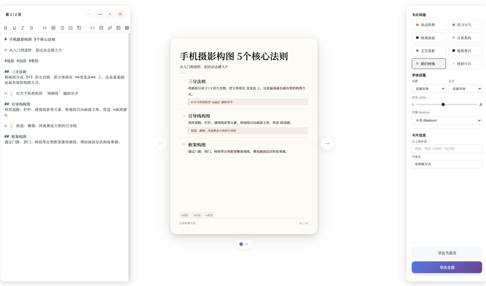
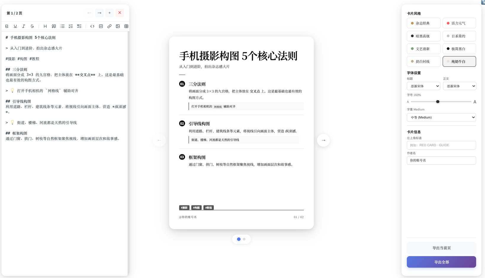
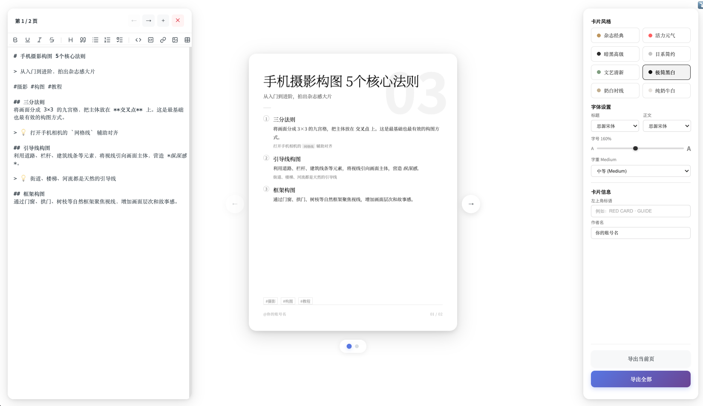

# RedCard Studio

将 Markdown 一键转换为小红书风格卡片，支持 8 种主题、自定义字体，导出高清 PNG。

🔗 **在线体验：[redcardstudio.pages.dev](https://redcardstudio.pages.dev)**

## 预览

| 文艺清新 | 纯奶牛白 | 极简黑白 |
|---------|---------|---------|
|  |  |  |

## 功能

- **Markdown 编辑器** — 实时预览，所见即所得，支持多页管理
- **8 种卡片风格**

  | 风格 key | 名称 | 适合内容 |
  |---------|------|---------|
  | `magazine` | 杂志经典 | 教程 / 攻略 |
  | `vibrant` | 活力元气 | 生活技巧 |
  | `dark` | 暗黑高级 | 技术干货 / 付费内容 |
  | `japanese` | 日系简约 | 极简生活 |
  | `literary` | 文艺清新 | 故事 / 随笔 |
  | `minimal` | 极简黑白 | 名人名言 |
  | `white` | 奶白衬线 | 散文 / 故事 |
  | `purewhite` | 纯奶牛白 | 极简纯净 |

- **字体 & 排版** — 标题 / 正文字体、字号、字重独立调节
- **一键导出** — 导出当前页或全部页为 1080×1440 高清 PNG

## 快速开始

```bash
git clone https://github.com/h-k-c/RedCardStudio.git
cd RedCardStudio
npm install
npm run dev
```

浏览器打开 `http://localhost:5173` 即可使用。

## 技术栈

- [Vue 3](https://vuejs.org/) + [TypeScript](https://www.typescriptlang.org/)
- [Vite](https://vitejs.dev/)
- [Pinia](https://pinia.vuejs.org/) 状态管理
- [html2canvas](https://html2canvas.hertzen.com/) 图片导出

## License

MIT
